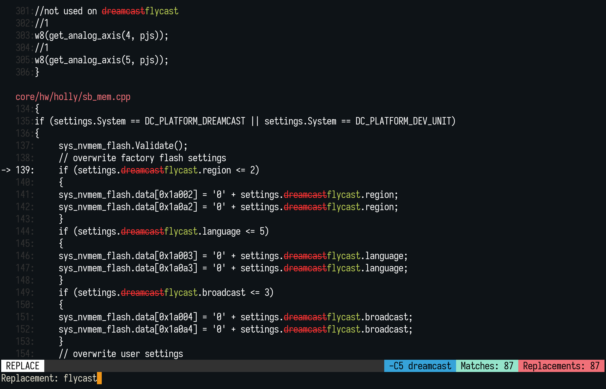

[](https://crates.io/crates/repgrep)
[](https://docs.rs/repgrep)
[](https://isitmaintained.com/project/acheronfail/repgrep "Average time to resolve an issue")
[](https://isitmaintained.com/project/acheronfail/repgrep "Percentage of issues still open")

# repgrep (rgr)

_An interactive replacer for `ripgrep`._

This is an interactive command line tool to make find and replacement easy.
It uses [`ripgrep`] to find, and then provides you with a simple interface to see
the replacements in real-time and conditionally replace matches.

Some features:

* ⚡ Super fast search results
* ✨ Interactive interface for selecting which matches should be replaced or not
* 🕶️ Live preview of the replacements
* 🧠 Replace using capturing groups (e.g., when using `/foo (\w+)/` replace with `bar $1`)
* 🦀 and more!

Supported file encodings:

* ASCII
* UTF8
* UTF16BE
* UTF16LE

Other encodings are possibly supported but untested at the moment.
See [this issue](https://github.com/acheronfail/repgrep/issues/12) for more information.

## Usage

After installing, just use `rgr` (think: `rg` + `replace`).

The arguments are:

```bash
rgr <rg arguments> # See `rgr --help` for more details
```

Here's an example where we ran the command:

```bash
rgr -C5 dreamcast
```

And have entered the replacement `flycast`:



## Installation

First and foremost, make sure you've installed `ripgrep` (AKA: `rg`).
To do so see the [`ripgrep` installation instructions].

#### Precompiled binaries

See the [releases] page for pre-compiled binaries.

#### Via Cargo

**NOTE**: The minimum Rust version required is `1.65.0`.

```bash
cargo install repgrep
```

#### Via Pacman (Arch Linux)

[`repgrep`](https://archlinux.org/packages/extra/x86_64/repgrep/) can be installed
from the official repositories using [Pacman](https://wiki.archlinux.org/title/Pacman).

```bash
pacman -S repgrep
```

#### Via MacPorts (macOS)

`repgrep` can also be installed on macOS using [MacPorts](https://www.macports.org):

```bash
sudo port install repgrep
```

More info [here](https://ports.macports.org/port/repgrep/).

#### From Source

**NOTE**: The minimum Rust version required is `1.65.0`.

```bash
git clone https://github.com/acheronfail/repgrep/
cd repgrep
cargo install --path .
```

[`ripgrep`]: https://github.com/BurntSushi/ripgrep
[releases]: https://github.com/acheronfail/repgrep/releases
[`ripgrep` installation instructions]: https://github.com/BurntSushi/ripgrep/#installation

License: Unlicense OR MIT OR Apache-2.0