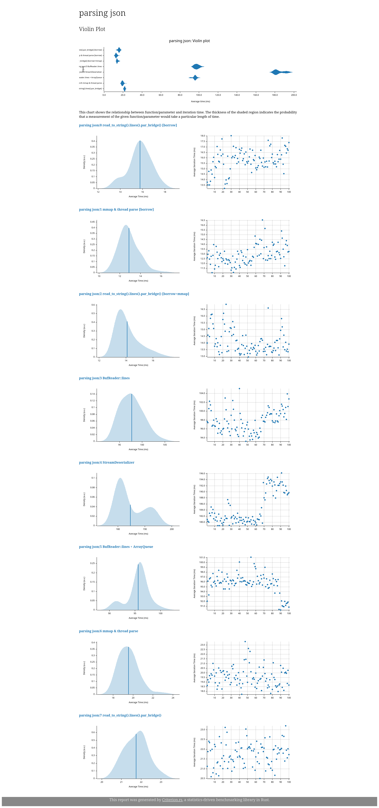

# Benchmarks

The current bottleneck of `repgrep` is parsing the JSON results from `ripgrep`.
`parsing_json.rs` contains some benchmarks of investigating different ways of making this faster.

The fastest solutions I've found have a memory tradeoff.

My conclusions are that the only way to make this faster and not have it be the bottleneck, would be to use `ripgrep` itself as a library.
Something like the discussions here: https://github.com/BurntSushi/ripgrep/issues/1009

